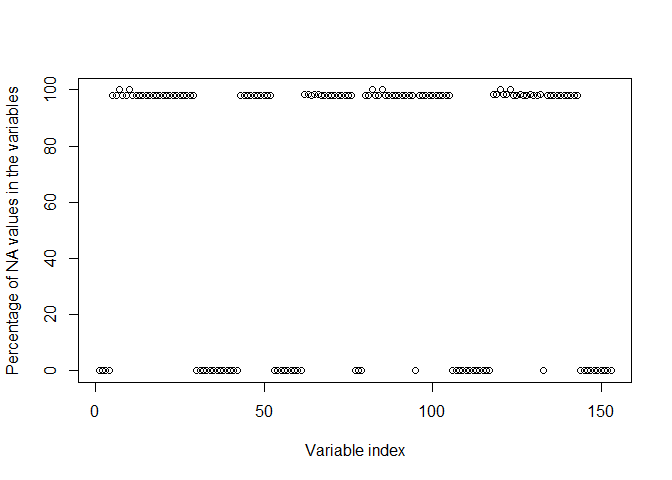
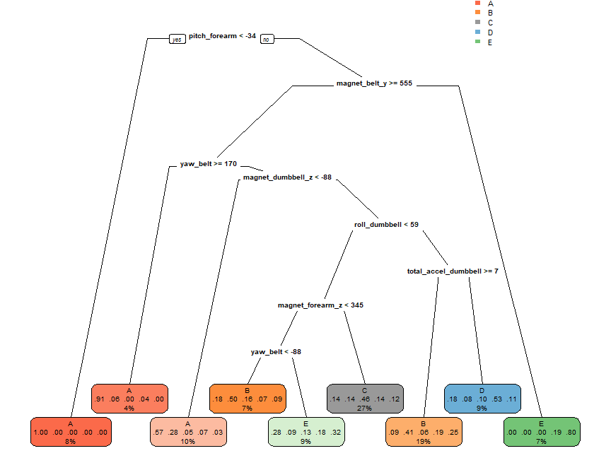
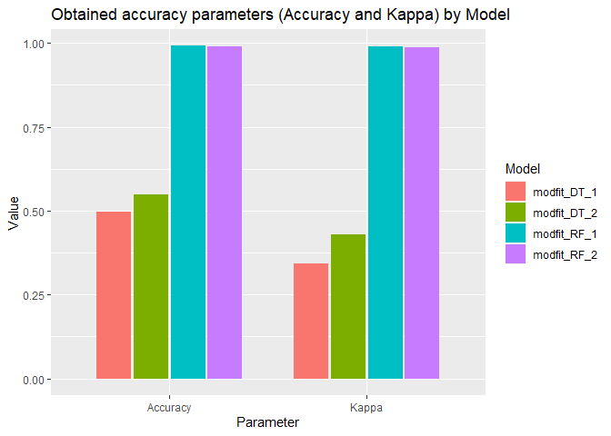

## Abstract

In this report a data set from body sensor network is investigated to predict the manner in which the unilateral dumbbell biceps curls are performed. The data is preprocessed and then used for training the Decision tree and Random forest models. The obtained results are compared and conclusions are made. 

## Loading and preprocessing the data

Load the libraries:


```r
suppressMessages(library(caret))
suppressMessages(library(rpart.plot))
```

Read the data:


```r
xtrain <- read.csv("https://d396qusza40orc.cloudfront.net/predmachlearn/pml-training.csv")
xtest <- read.csv("https://d396qusza40orc.cloudfront.net/predmachlearn/pml-testing.csv")
```

Inspect the dimensions


```r
dim(xtrain) 
```

```
## [1] 19622   160
```

```r
dim(xtest)
```

```
## [1]  20 160
```

As follows, there are 160 variables. The "classe" variable in xtrain
indicates five different fashions (A, B, C, D, E)  
the unilateral dumbbell biceps curls are performed: the type A is the correct way of
performing the exercise, while the rest 4 types are erroneous:


```r
table(xtrain$classe)
```

```
## 
##    A    B    C    D    E 
## 5580 3797 3422 3216 3607
```

The task of the model is to recognize which type better describes the
exercise being performed depending on the data from the sensors.

As the number of variables is large, the first step is to choose which variables
to use for the model. In this regard, the first seven variables are
excluded from xtrain as 
they are not related to the data coming from the sensors:


```r
y <- xtrain[,-(1:7)]
```

Next, it is observed, that many variables are of character type:


```r
table(sapply(y,class))
```

```
## 
## character   integer   numeric 
##        34        31        88
```

These (except the "classe" variable) are converted to numeric type:


```r
ind <- which(names(y)=="classe")
y[,-ind] <- apply(y[,-ind],2,function(x){suppressWarnings(as.numeric(x))})
```

Next, it is found that many 
variables have large number of NA values in comparison to the total amount of
observations:


```r
plot(100*colSums(is.na(y))/(dim(y)[1]), 
     ylab="Percentage of NA values in the variables",
     xlab="Variable index")
```

<!-- -->

These variables are excluded from the data:


```r
y <- y[,colSums(is.na(y))<10000]
dim(y)
```

```
## [1] 19622    53
```

It is also verified that there are no near zero variables:


```r
nearZeroVar(y)
```

```
## integer(0)
```

In addition, the indices of the highly correlated variables are found to be later removed when training the models:


```r
ind_HighCorr <- findCorrelation(cor(y[,-which(names(y)=="classe")]), cutoff = 0.75)
```


## Splitting the data:

Before training the models, the data is split into two parts for training and testing purposes, respectively:


```r
set.seed(71)
inTrain <- createDataPartition(y$classe, p=0.6, list = FALSE)
training <- y[inTrain, ]
testing <- y[-inTrain, ]
```


## Predicting with Decision tree:

Training and predicting when no correlated variables are removed:


```r
modfit_DT_1 <- train(classe ~ ., data=training, method="rpart")
pred_DT_1 <- predict(modfit_DT_1, testing) 
cM_DT_1 <- confusionMatrix(pred_DT_1,as.factor(testing$classe))
cM_DT_1$table; cM_DT_1$overall
```

```
##           Reference
## Prediction    A    B    C    D    E
##          A 2033  641  631  580  205
##          B   35  499   42  235  194
##          C  157  378  695  471  362
##          D    0    0    0    0    0
##          E    7    0    0    0  681
```

```
##       Accuracy          Kappa  AccuracyLower  AccuracyUpper   AccuracyNull 
##      0.4980882      0.3438753      0.4869635      0.5092144      0.2844762 
## AccuracyPValue  McnemarPValue 
##      0.0000000            NaN
```

Training and predicting when correlated variables are removed:


```r
modfit_DT_2 <- train(classe ~ ., data=training[, -ind_HighCorr], method="rpart")
pred_DT_2 <- predict(modfit_DT_2, testing) 
cM_DT_2 <- confusionMatrix(pred_DT_2,as.factor(testing$classe))
cM_DT_2$table; cM_DT_2$overall
```

```
##           Reference
## Prediction    A    B    C    D    E
##          A 1367  253   36   85   32
##          B  214  850  204  290  386
##          C  354  297  984  325  236
##          D  105   49   64  369   65
##          E  192   69   80  217  723
```

```
##       Accuracy          Kappa  AccuracyLower  AccuracyUpper   AccuracyNull 
##   5.471578e-01   4.306386e-01   5.360640e-01   5.582165e-01   2.844762e-01 
## AccuracyPValue  McnemarPValue 
##   0.000000e+00  7.633527e-235
```

As follows, when the correlated variables are removed, the accuracy improves, although is still not high. The obtained decision tree is shown below:


```r
rpart.plot(modfit_DT_2$finalModel,  type = 0, clip.right.labs = FALSE, branch = .5)
```

<!-- -->

## Predicting with Random forest:

Training and predicting when no correlated variables are removed:


```r
modfit_RF_1 <- train(classe ~ ., data=training, method="rf")
pred_RF_1 <- predict(modfit_RF_1, testing) 
cM_RF_1 <- confusionMatrix(pred_RF_1,as.factor(testing$classe))
cM_RF_1$table; cM_RF_1$overall
```

```
##           Reference
## Prediction    A    B    C    D    E
##          A 2230   14    0    0    0
##          B    1 1497   12    1    2
##          C    0    7 1351   20    2
##          D    0    0    5 1264    3
##          E    1    0    0    1 1435
```

```
##       Accuracy          Kappa  AccuracyLower  AccuracyUpper   AccuracyNull 
##      0.9912057      0.9888740      0.9888833      0.9931513      0.2844762 
## AccuracyPValue  McnemarPValue 
##      0.0000000            NaN
```

Training and predicting when correlated variables are removed:


```r
modfit_RF_2 <- train(classe ~ ., data=training[, -ind_HighCorr], method="rf")
pred_RF_2 <- predict(modfit_RF_2, testing) 
cM_RF_2 <- confusionMatrix(pred_RF_2,as.factor(testing$classe))
cM_RF_2$table; cM_RF_2$overall
```

```
##           Reference
## Prediction    A    B    C    D    E
##          A 2230    7    0    2    0
##          B    1 1508   19    0    0
##          C    0    3 1344   29    0
##          D    0    0    5 1250    1
##          E    1    0    0    5 1441
```

```
##       Accuracy          Kappa  AccuracyLower  AccuracyUpper   AccuracyNull 
##      0.9906959      0.9882291      0.9883155      0.9927002      0.2844762 
## AccuracyPValue  McnemarPValue 
##      0.0000000            NaN
```

As follows, there is no great difference between  modfit_RF_1 and modfit_RF_2, which means that random forest method is more robust against using correlated data. Also, the achieved precision is much higher than was obtained by the tree model, although at much higher training time.

The accuracy parameters (accuracy and kappa) are compared below: the most precise model is modfit_RF_1, which will be applied to the test data xtest.


```r
df <- data.frame("Model" = rep(c("modfit_DT_1", "modfit_DT_2",
                                 "modfit_RF_1", "modfit_RF_2"), each=2),
                 "Parameter" = rep(names(cM_DT_1$overall)[1:2], times=4),
                 "Value" = c(cM_DT_1$overall[1:2], cM_DT_2$overall[1:2],
                             cM_RF_1$overall[1:2], cM_RF_2$overall[1:2]))

ggplot(data=df, aes(x=Parameter, y=Value, fill=Model)) +
  geom_bar(width=0.7, position=position_dodge(width=0.75), stat="identity") +
  labs(title="Obtained accuracy parameters (Accuracy and Kappa) by Model") 
```

<!-- -->

## Result of predicting 20 different test cases

Apply modfit_RF_1 on xtest:


```r
result <- predict(modfit_RF_1, xtest[,names(y[,1:length(y)-1])])
result
```

```
##  [1] B A B A A E D B A A B C B A E E A B B B
## Levels: A B C D E
```

## Conclusions

The random forest model modfit_RF_1 provided the most precision with the values "Accuracy" = 0.99 and "Kappa" = 0.99. Only slight differences between modfit_RF_1 and modfit_RF_2 were observed, indicating that correlations between variables did not affect the result.
